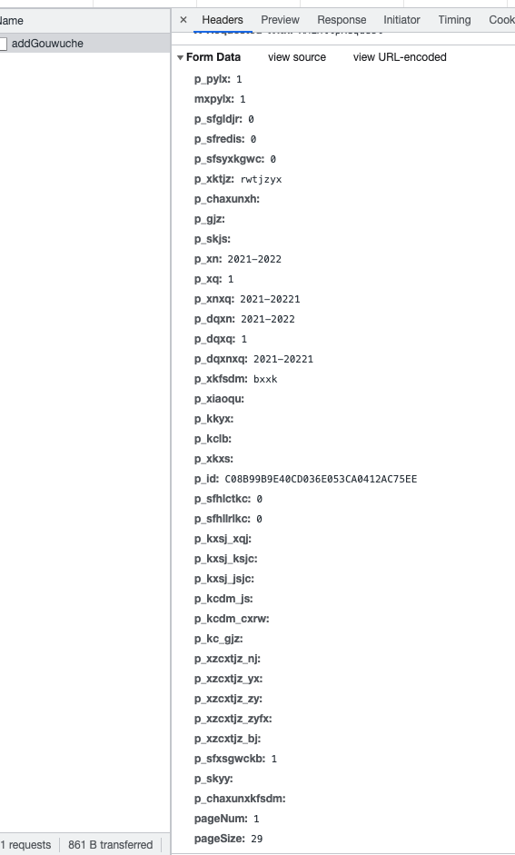

# SUSTech TIS 退补选抢课

[](https://github.com/HeZean/SUSTech-tisQiangke)    


### Before we start

```bash
pip install requests  # 请确保电脑装有 Python 3 环境，并安装 pip 或 conda
```

### Usage

> 建议在开始抢课前一两分钟运行脚本，同时自己手动抢课  

1. 将`user.json`里的`sid`和`pwd`改为自己的学号和cas密码

2. 进入选课界面，找到你要抢的课，点`选课`键


    #### 选课按钮是被禁用的？

      1. 在按钮上右键，点击`inspect`  
         
         
      2. 屏幕右侧的开发者工具会弹出并标亮一行代码，双击`disabled="disabled"`并全选删除  
         
         
      3. 这时按钮已经变成绿色可用状态，点击按钮系统上方应该会出现错误信息（「不在选课时段」，因为正常人大概会选择在开始抢课前配置脚本）


3. 将开发者工具上方的标签页切换至`Network(Fetch/XHR)`，多按几下按钮，最后几条请求应该都是`addGouwuche`  
   

4. 点击请求名字，展开请求信息，`Headers`栏下划到底出现`Form Data`  
   
   
    1. 大部分header项目不用管，其中，json文件里`ele_head`里的项目每学期的是统一，填一次即可

    2. json中的`courses`里保存的是每门课独有的信息，`p_xkfsdm`和`p_id`是headers里的
    
    3. 选多门课只需要把**花括号**及里面的内容复制多份到下方并修改内容即可（注意逗号）

5. 运行脚本，have fun！
```
python3 /path/to/this/file/tis.py
```

**本代码仅供技术交流使用，个人使用不当造成的一切后果自负。**
