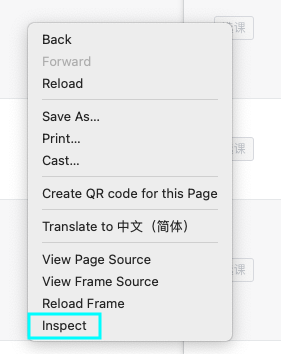
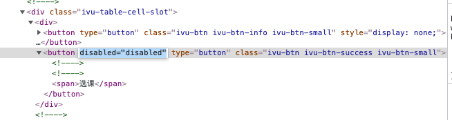
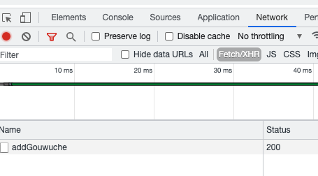

# SUSTech tis退补选抢课


> Ver 1.0 只抢一门课的较手动版本（反正我也只掉了一门课XD
> 2021-09-03 暂未经过实战测试
> works on python3
> package `requests` required
> ```
> pip install requests
> ```


## USAGE

1. 将`user.json`里的`sid`和`pwd`改为自己的学号和cas密码
2. 进入选课界面，找到你要抢的课，点`选课`键


    #### 选课按钮是被禁用的？
    1. 在按钮上右键，点击`inspect`
    
    2. 屏幕右侧的开发者工具会弹出并标亮一行代码，双击`disabled="disabled"`并全选删除
    
    3. 这时按钮已经变成绿色可用状态，点击按钮系统上方应该会出现错误信息（因为你大概会在开始抢课前配置脚本）


3. 将开发者工具上方的标签页切换至`Network(Fetch/XHR)`，多按几下按钮，最后几条请求应该都是`addGouwuche`

4. 点击请求名字，展开请求信息，`Headers`栏下划到底出现`Form Data`，将其对应的条目填入`user.json`里的`"ele_head"`里同名处（如为空则不用填，但也别删）

5. 运行脚本，have fun！
```
python3 /path/to/this/file/tis.py
```